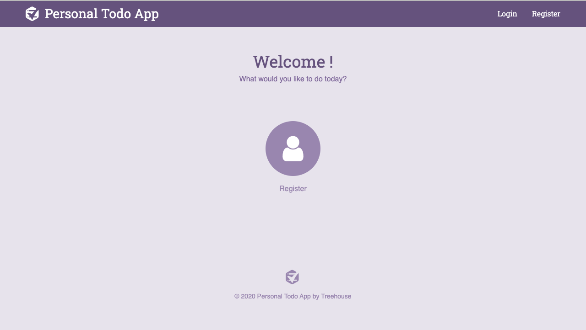
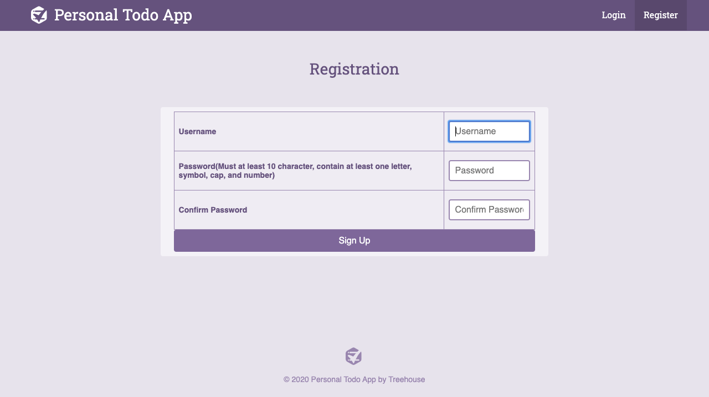
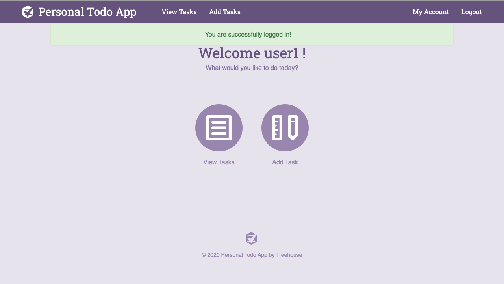
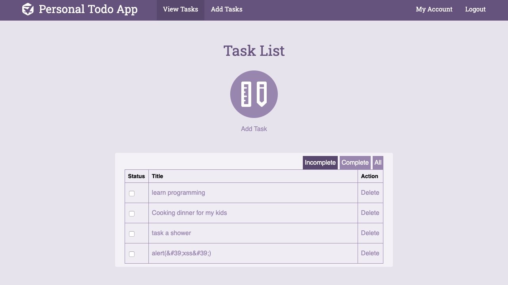
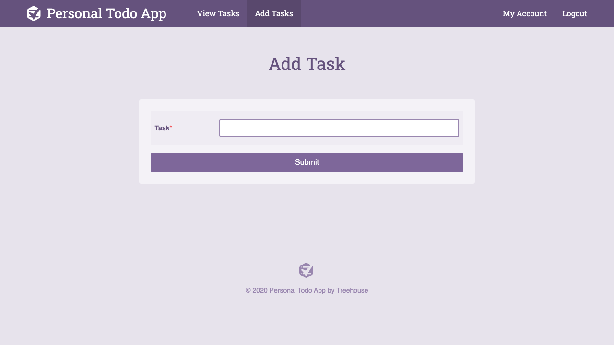
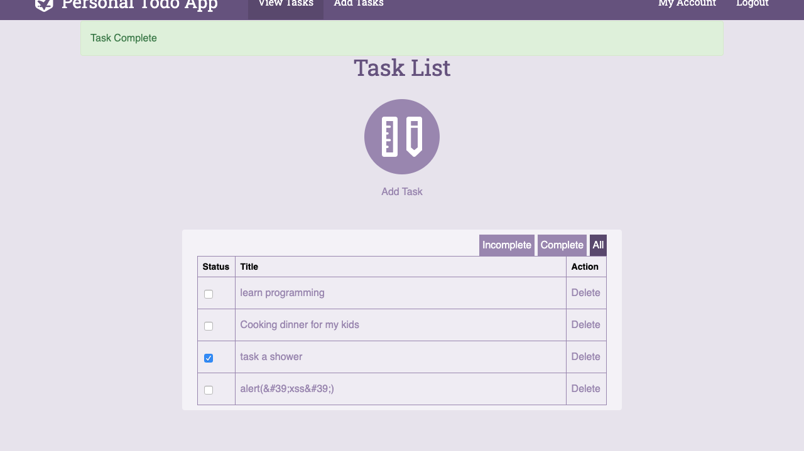

# project8_task_auth

**project8_task_auth** 

The task_auth project build with php 7. It uses cookies and JWT to secure the tasks each user created. This project is part of my learning journey with teamtreehouse.com php tech degree. It demonstrates my ability to use jwt and cookies to provide authentication and authorization services to a system. 

Note: 

Teamtreehouse.com PHP Techdegree exceeding grade changes: auto login after signup, use jwt to secure the cookies.

## How to setup on local machine

git clone https://github.com/allan9595/project8_task_auth.git

Place the repo in a web server of your choice (XAMPP for Windows, MAMP for Mac)

Install PHP(version must be match with the web server's php version) and composer, see [https://getcomposer.org/download/](https://getcomposer.org/download/) for the process.

Open a terminal under the folder and type in "composer install" 

Then "composer update"

Create a file called .env under /inc, then typing in SECRET_KEY = YOUR_SECURE_KEY

For easier signup process, please use "hardtocracK123$321" as the example password

## Screenshots

## License

   The MIT License

    Copyright (c) BOHAN ZHANG

    Permission is hereby granted, free of charge, to any person obtaining a copy
    of this software and associated documentation files (the "Software"), to deal
    in the Software without restriction, including without limitation the rights
    to use, copy, modify, merge, publish, distribute, sublicense, and/or sell
    copies of the Software, and to permit persons to whom the Software is
    furnished to do so, subject to the following conditions:

    The above copyright notice and this permission notice shall be included in
    all copies or substantial portions of the Software.

    THE SOFTWARE IS PROVIDED "AS IS", WITHOUT WARRANTY OF ANY KIND, EXPRESS OR
    IMPLIED, INCLUDING BUT NOT LIMITED TO THE WARRANTIES OF MERCHANTABILITY,
    FITNESS FOR A PARTICULAR PURPOSE AND NONINFRINGEMENT. IN NO EVENT SHALL THE
    AUTHORS OR COPYRIGHT HOLDERS BE LIABLE FOR ANY CLAIM, DAMAGES OR OTHER
    LIABILITY, WHETHER IN AN ACTION OF CONTRACT, TORT OR OTHERWISE, ARISING FROM,
    OUT OF OR IN CONNECTION WITH THE SOFTWARE OR THE USE OR OTHER DEALINGS IN
    THE SOFTWARE.